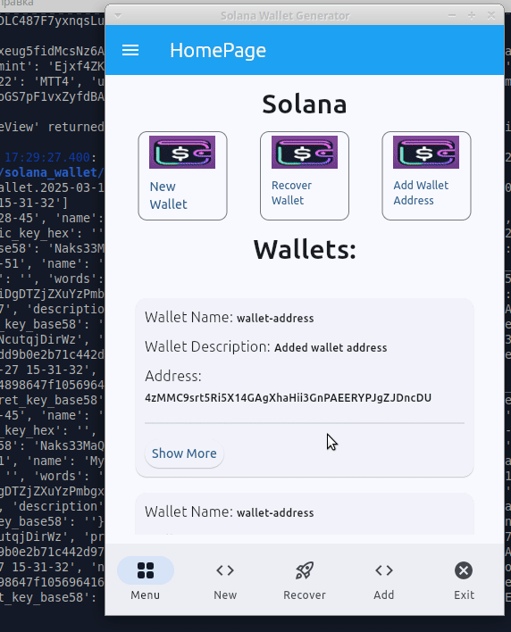
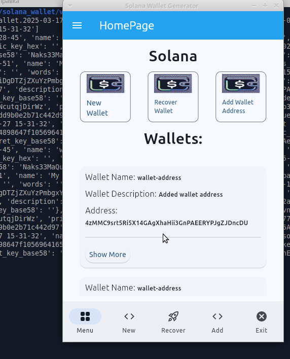

# Solana Wallet

## Strongly `not recommended` for real use.

### Experimental android application of cryptocurrency wallet on the Solana blockchain.

### This application is currently under development and does not comply with generally accepted code quality standards.

### The application has not been tested and checked for errors. Many functions are not implemented.

## Run the app

### Pip

Install dependencies from `requirements.txt`:

```
pip install -r requirements.txt
```

Run as a desktop app:

```
flet run
```

### Poetry

Install dependencies from `pyproject.toml`:

```
poetry install
```

Run as a desktop app:

```
poetry run flet run
```

For more details on running the app, refer to the [Getting Started Guide](https://flet.dev/docs/getting-started/).

## Build the app

### Android

```
pip cache purge
flet build apk -v
```

For more details on building and signing `.apk` or `.aab`, refer to the [Android Packaging Guide](https://flet.dev/docs/publish/android/).

## Created Functionality

### Created Wallet

- Creating a completely new wallet
- Wallet recovery from a `secret phrase` (12 or 24 words) or from a `secret key` in the format (private key + public key, 88 characters long)
- Add address without adding secret data

### Networking

- Getting balance for `Sol` and `Spl-tokens`
- Getting metadata (name, symbol, etc.) of `Spl-tokens`
- Transfer of native token `Sol`

#### Networks

- `https://api.mainnet-beta.solana.com` - real network, `not recommended` for use with this wallet
- `https://api.testnet.solana.com` - test network, `recommended` for testing
- `https://api.devnet.solana.com` - network for developers, `recommended` for testing

### Mobile application

- Android application is created using Python framework `flet`

## Demo

#### Create New Wallet



#### Get Balance


#### Transfer Sol



### Link to download the `apk` file for installation on an android smartphone

https://drive.google.com/file/d/18RlN6pUlZjgy1-NZ4sq97OECLHIBgQkR/view?usp=sharing