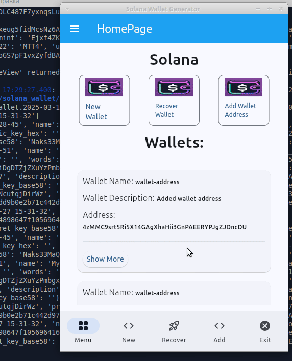
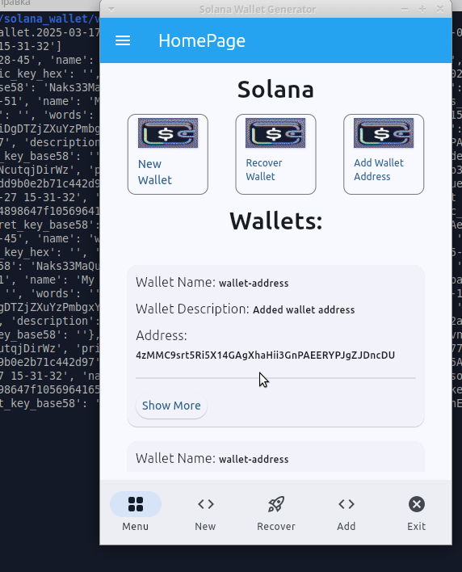

# Solana Wallet

> **Strongly `not recommended` for real use.**
>
> Experimental Android cryptocurrency wallet for the Solana blockchain, written in
> **Python + Flet** (Flutter UI). The entire Solana layer in `src/solana/` is
> **hand-rolled** — there is no dependency on `solana-py` / `solders`.

The application is under active development, does not meet generally accepted code
quality standards, has not been security-audited, and many features are still
experimental. **Do not store real funds in it.**

## Features

### Wallets

- Create a brand-new wallet (BIP39 + BIP32-ed25519 key derivation)
- Recover from a **secret phrase** (12 or 24 words) or a **secret key** (base58)
- Add a **watch-only address** (no secret data stored)
- Wallet secrets are **encrypted at rest** (Fernet) with a PIN-derived key;
  the PIN itself is never persisted. Auto-lock after inactivity.
- Seed-phrase backup quiz on wallet creation
- Per-wallet QR codes (receive) + copy address

### Balances & tokens

- SOL + SPL / **Token-2022** balances, with per-token metadata (name, symbol, image)
- **USD portfolio** value via the Jupiter Price API V3 (mainnet only)
- **Spam / scam token filter** — curated registries + impersonation/authority-risk
  heuristics; confirmed spam tokens are hidden behind a toggle
- NFT gallery (Metaplex metadata, IPFS image rewriting, attributes)
- Priority-fee selector (Auto / Low / Medium / High / Custom)
- Transaction history with CSV export

### Transfers & DeFi

- Native SOL transfer (with transfer-cost estimate + SNS `.sol` name resolution)
- SPL / Token-2022 transfer, plus **burn** and **burn & close account** (rent refund)
- **Liquid staking** (JitoSOL / mSOL / bSOL / jupSOL) via Jupiter, mainnet only
- **Jupiter Swap** (SOL / USDC / USDT / JUP), mainnet only, with a safe-route retry
  that refuses orders touching programs outside an allowlist
- dApp signing capability layer: `signMessage`, `signTransaction`,
  `signAndSendTransaction`, and **Sign-In-With-Solana (SIWS)**
- **Anti-phishing transaction simulation** — per-account SOL/token deltas, predicted
  status, compute units, fee and warnings, shown before any signing

### WalletConnect v2 (dApp transport, hand-rolled)

- Pair via `wc:` URI, approve/reject session proposals, route incoming requests
  through simulation → sign. No WalletConnect JS SDK; every crypto byte
  (X25519 ECDH, ChaCha20-PolyAC1305 AEAD, relay JWT) is reverse-engineered for
  bit-compatibility with real dApps.

### Tiered UI (Simple / Pro / Developer)

- A persisted experience level gates feature visibility and detail. Developer mode
  unlocks a Storage inspector, a transaction-simulation inspector, a raw JSON-RPC
  inspector, and a raw-keys exporter.

## Tech stack & architecture

| Layer | Location | Notes |
| --- | --- | --- |
| Blockchain logic | `src/solana/` | Hand-rolled (no `solana-py`/`solders`) |
| UI package | `src/ui/` | Extracted from a former monolith (`main.py`) |
| Entry point | `src/main.py` | Thin `build_app(page)` delegation |
| Wallet storage | Flet `shared_preferences` | Encrypted JSON under `wallet.<timestamp>` |

The UI is organized as one module per screen (`src/ui/components/*.py`), each taking
an `AppContext` object that wraps the live `page` / `session` state.

## Run the app

### Prerequisites

Python **3.12+** and a virtualenv.

### Pip

```bash
git clone https://github.com/o5b/android-solana-wallet.git
cd android-solana-wallet/
python3.12 -m venv venv
source venv/bin/activate
pip install -r requirements.txt
```

Run as a **desktop** app (needs a display, i.e. `DISPLAY` set):

```bash
flet run src/main.py
```

Run in **web** mode (handy for testing; required for browser automation):

```bash
flet run --web --port 8550 src/main.py
```

### Poetry

```bash
poetry install
poetry run flet run src/main.py
```

For more details, refer to the [Flet Getting Started Guide](https://flet.dev/docs/getting-started/).

## Build the Android APK

The build packages the Python app with [`serious_python`](https://pub.dev/packages/serious_python),
which embeds a CPython 3.12 runtime and pre-built Android wheels (served from
`https://pypi.flet.dev`). The `flet build apk` command **auto-provisions the Android
SDK** if it is missing; you still need **Flutter** and **JDK 17**.

### Prerequisites

- Flutter SDK (Flet CLI also bundles one)
- JDK 17
- Internet access (downloads the Android SDK, Gradle, and Python wheels)

### Build (debug-signed)

```bash
cd android-solana-wallet/
source venv/bin/activate
flet build apk -v
```

Output: `build/apk/<product>.apk` (≈87 MB, fat APK with all ABIs).

> **Note on dependency versions.** The Android wheel index (`pypi.flet.dev`) carries
> a specific set of versions. The pins in `pyproject.toml` / `requirements.txt`
> (`pillow==12.2.0`, `websockets==16.0`, `cryptography==43.0.1`, `PyNaCl==1.5.0`)
> are chosen to match that index. C-extension packages resolve to pre-built Android
> wheels; pure-Python packages come from PyPI.

### Build a release-signed APK (recommended for installation on a phone)

A debug-signed APK is frequently rejected by **Google Play Protect** or with an
"App not installed" error on some devices. Sign with a real key instead.

> **Why re-sign with `apksigner` instead of `--android-signing-*` flags?**
> Flet's built-in signing passes the credentials to Gradle via environment
> variables, and a long-lived Gradle daemon can end up reading a stale password,
> failing the build with `keystore password was incorrect` even though the
> keystore is valid. Signing the produced APK with `apksigner` (the standard
> Android workflow) is reliable, so that is the documented path here.

```bash
cd android-solana-wallet/
source venv/bin/activate
STOREPASS=change-me             # choose a strong password

# 1. Create a release keystore (once, 25-year validity)
keytool -genkeypair -v -keystore release.keystore -alias solana \
  -keyalg RSA -keysize 2048 -validity 9125 \
  -storepass "$STOREPASS" -keypass "$STOREPASS" \
  -dname "CN=Solana Wallet, O=SolanaWallet, C=RU"

# 2. Build the APK (produces a debug-signed release build)
flet build apk -v

# 3. zipalign + re-sign it with your release key
BUILD_TOOLS=$(ls -d /path/to/Android/sdk/build-tools/* | tail -1)   # adjust path
"$BUILD_TOOLS/zipalign" -f -p 4 build/apk/solana_wallet_v3.apk build/apk/aligned.apk
"$BUILD_TOOLS/apksigner" sign \
  --ks release.keystore --ks-key-alias solana \
  --ks-pass "pass:$STOREPASS" --key-pass "pass:$STOREPASS" \
  --out build/apk/solana_wallet_v3-release.apk build/apk/aligned.apk

# 4. Verify
"$BUILD_TOOLS/apksigner" verify --verbose build/apk/solana_wallet_v3-release.apk
```

Output: `build/apk/solana_wallet_v3-release.apk`.

Keep `release.keystore` and the passwords safe and **out of git** (they are in
`.gitignore`). Losing the keystore means you can never publish an update to the same
package id.

### Smaller per-architecture APK

```bash
flet build apk -v --split-per-abi --android-signing-key-store release.keystore ...
```

This produces one APK per ABI (~25–30 MB). Real phones need the **arm64-v8a** build.

For full packaging/signing details, see the
[Flet Android Packaging Guide](https://flet.dev/docs/publish/android/).

## Install on an Android phone

1. Copy the `build/apk/*.apk` file to the phone.
2. Enable **"Install unknown apps"** for your file manager / browser.
3. Open the APK and install.

**If Google Play Protect blocks the install** ("Play Protect doesn't recognize this
app's developer" / "Blocked by Play Protect"):

- Tap **More details → Install anyway (unsafe)**, **or**
- Open **Play Store → profile → Play Protect → settings (gear) → disable
  "Scan apps with Play Protect"**, install, then re-enable it.

A release-signed APK (see above) is blocked far less often than a debug-signed one.

## Networks (Solana RPC)

| Network | Endpoint | Use |
| --- | --- | --- |
| mainnet-beta | `https://api.mainnet-beta.solana.com` | Real funds — `not recommended` |
| testnet | `https://api.testnet.solana.com` | Testing |
| devnet | `https://api.devnet.solana.com` | Testing — **recommended** |

Public RPCs are heavily rate-limited (HTTP 429).

## Testing

Headless (fast — no UI) and integration tests live in `tests/`. Run with the venv
interpreter and `src/` on the path:

```bash
PYTHONPATH=src venv/bin/python tests/test_<name>.py
```

Syntax-check a single module after edits:

```bash
venv/bin/python -c "import py_compile; py_compile.compile('src/solana/<file>.py', doraise=True)"
```

## Demo

#### Create New Wallet



#### Get Balance


#### Transfer Sol


